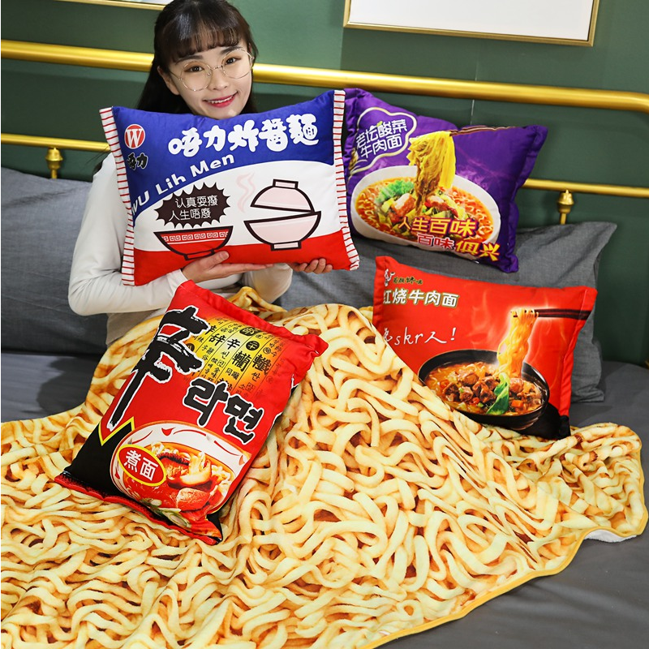
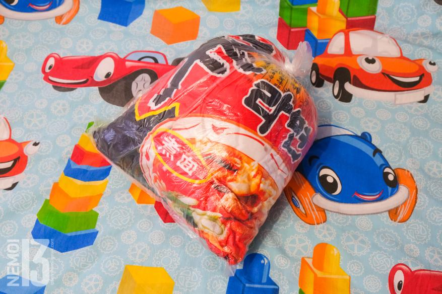
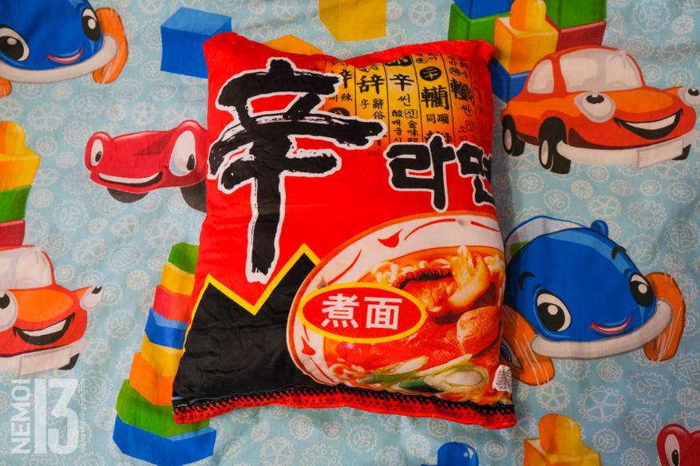
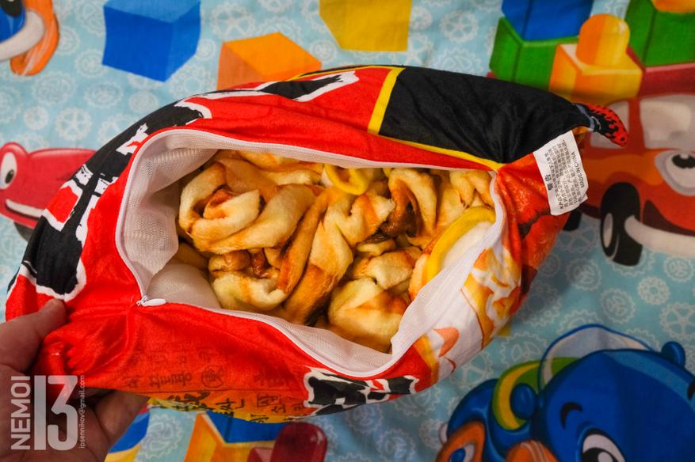
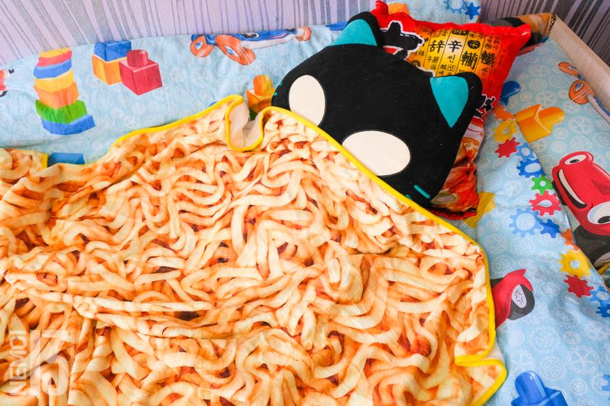

# Plush pillow and plaid with Korean Shin Ramyun Nongshim noodle print

## A warm plaid and pillow is always a good thing. And when that plaid and pillow have a different look, it's even better. Quite by chance I came across a plaid and a pillow painted to look like Chinese (Korean) ramen noodles in another selection. My heart wavered, I'm a very impulsive person. I'm not allowed to see such things. A few minutes later, a new item appeared in my shopping history:
Kawaii blanket imitation instant noodle plush pillow with blanket Stuffed beef fried noodle gifts plush pillow food plush toy "awaiting shipment".

Nah, well, is it possible not to buy such a pretty thing? I'm a grown, established man, and I need that plaid and noodle print pillow! I really do!

A couple of days later, the package was shipped by the Chinese, and three more weeks later I had it. I'll be honest, I don't go after new products from Xiaomi with such an eagerness as I ran for this parcel.

### And here it is. My beauty. In the bag. Lies.

I open the bag, there is only a pillow inside. With a bright red Korean Shin Ramyun Nongshim noodle print. This is one of the most popular and popular ramen. They even sell it in regular supermarkets. However, I don't really like these noodles specifically for their spicy taste. Excessively hot, you know the joke: real hot peppers burn three times. These noodles also burn at least twice. But that's just a saying. We're talking about a pillow, not noodles.

### So this is the pillow that came to me:

.jpeg

Well and you can also see that inside the pillow there is a mesh, behind which there is a synthetic filler. It's stitched in there behind the mesh, and it's a little small in my opinion. The plan is to get half a kilo of filler at a sewing store later and stuff the pillow thicker.

The plaid material is very soft plush. With a slight nap. The top side is covered with a noodle print, and the inside is just white. The outline of the plaid is trimmed with yellow fabric.

However, the sewing is not great. Sometimes there are some threads and also in some places there are crooked seams. But then again the Chinese. They can not do otherwise, it is in their genetics.

But in general the pattern is not bad. Especially not to pick on.

The dimensions of the rug were measured by me. On the page of the store it is written that the plaid has the size 193*65cm. My measurements showed a size of 157*96cm. Well, yes, again it is clear that the plaid was measured with a real Chinese tape measure.

You could, of course, and show the seller about the discrepancy in size. But okay. I'm not so bad.

Well, below pictures of trying on the plaid and pillow. None of the children did not want to pose. Therefore, as the test subject is a teddy cat.

### After lying under the plaid for about an hour at room temperature, the cat said that the plaid is very soft and cozy. It's warm under it, but if it were a little longer (about the height of an adult), the plaid would be small. I was honestly afraid that the material would be completely synthetic, but to my joy, here the material is really nice to the touch.

